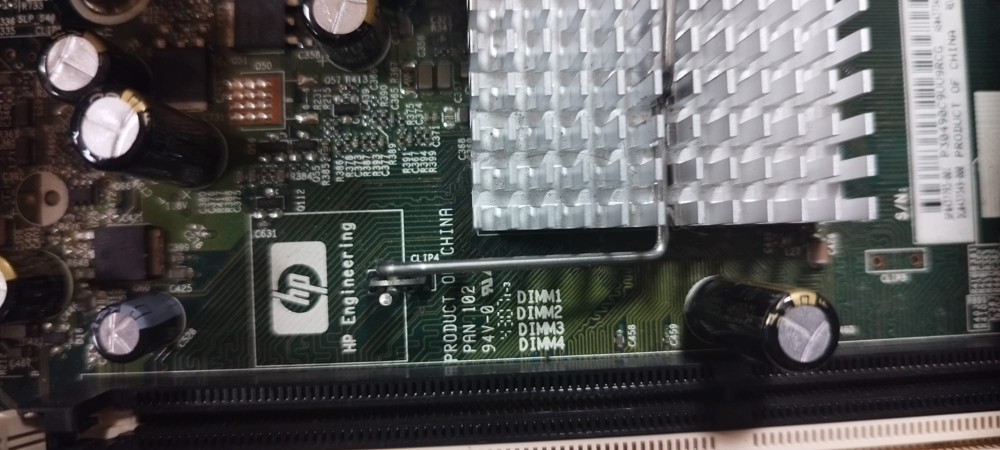
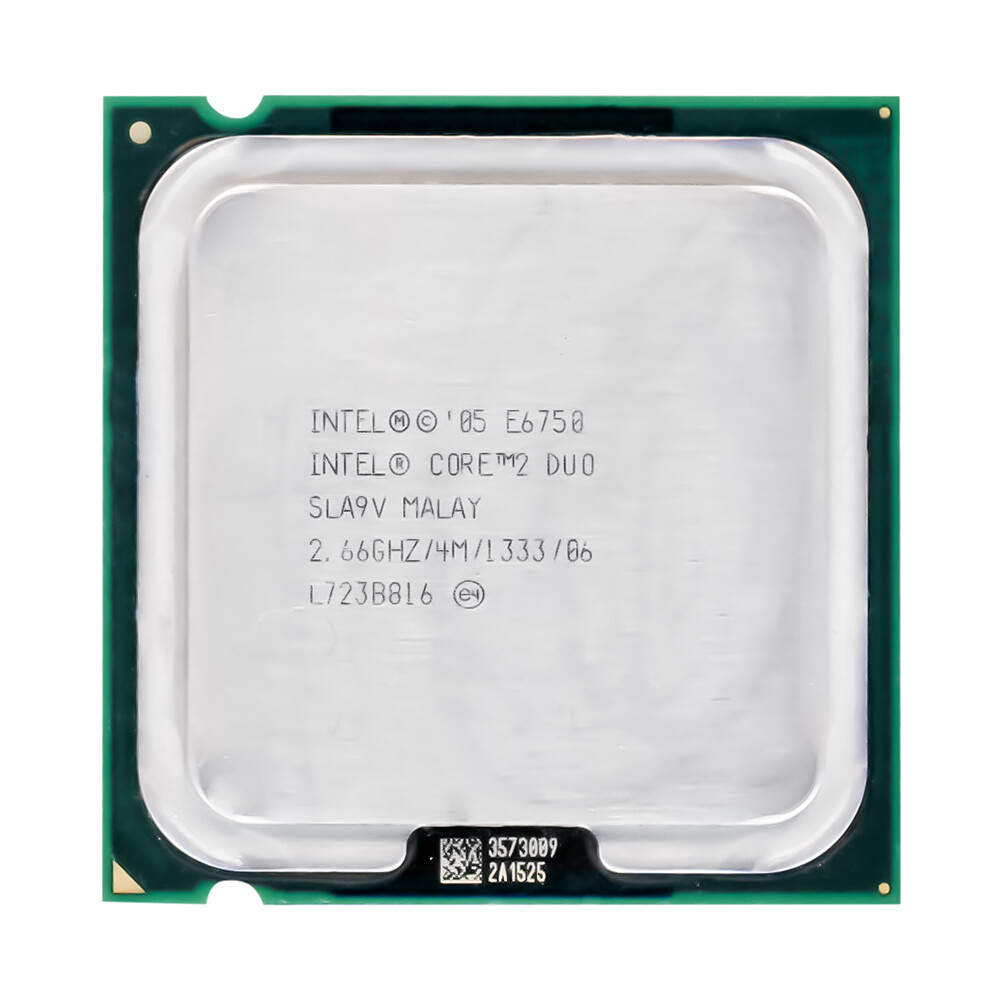
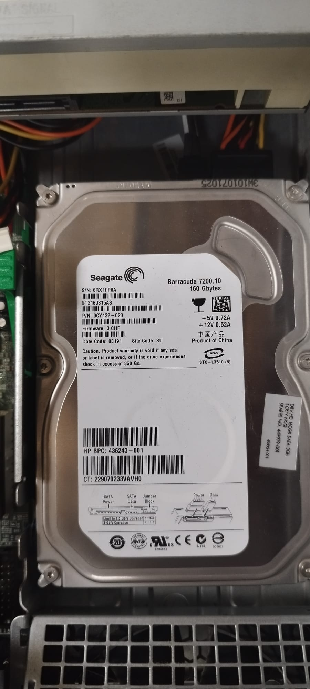
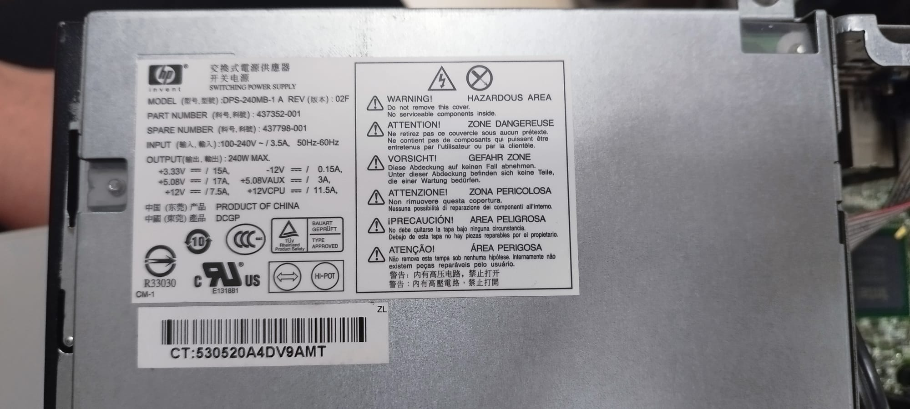
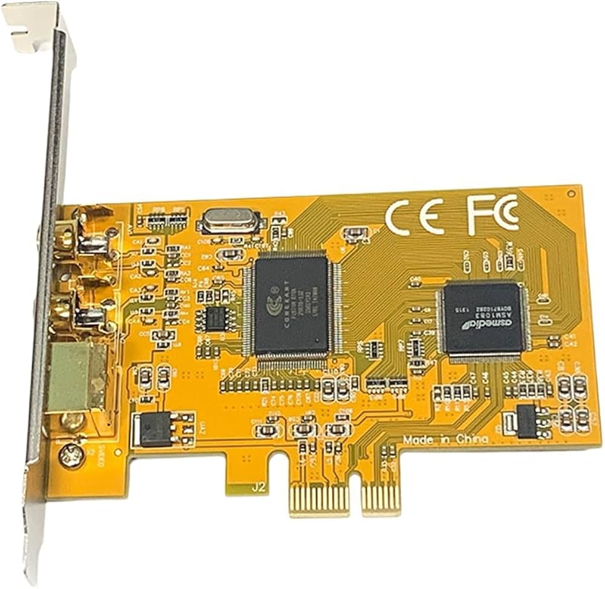
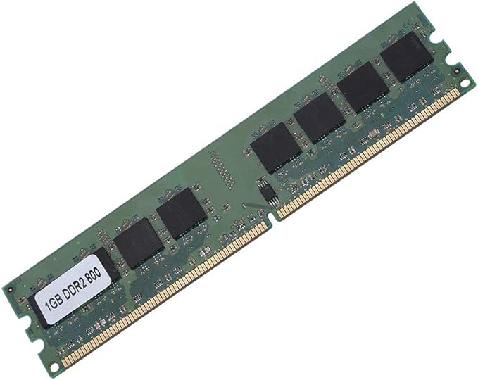
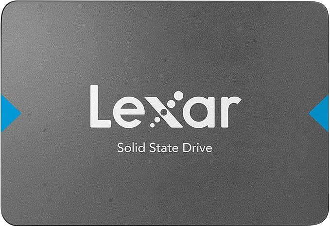

# 90 — ENTREGA ÚNICA (consolidado)

Copia aquí lo esencial de **toma de datos**, **investigación técnica**, **recambios** y **observaciones**, con las **imágenes clave** (rutas relativas).

## Portada

## Indice
# 01 — Índice
1. [Portada](00-portada.md)
2. [Instrucciones](02-instrucciones.md)
3. [Toma de datos en taller](10-toma_de_datos/plantilla_tabla_taller.md)
4. [Investigación técnica](20-investigacion_tecnica/plantilla_investigacion.md)
5. [Mercado y recambios](30-mercado_y_recambios/plantilla_recambios.md)
6. [Observaciones personales](40-observaciones/plantilla_observaciones.md)
7. [ENTREGA ÚNICA](90-ENTREGA_UNICA.md)
8. [Checklist](99-entrega_y_checklist.md)
## Toma de datos — resumen
# 10 — Toma de datos (taller)

> Inserta fotos en `assets/img/10-toma_de_datos/` y enlázalas aquí con rutas relativas.

| Componente                  | Marca/Fabricante            | Modelo/Serie      | Características técnicas visibles               | Foto                                                                                                                                                                                                                      |
| ----------------------------- | ----------------------------- | ------------------- | --------------------------------------------------- | --------------------------------------------------------------------------------------------------------------------------------------------------------------------------------------------------------------------------- |
| **Placa base**              | HP                          | DC7800 SFF        | Q35 Express, LGA775, 4 Slots de RAM               |  |
| **Microprocesador**         | Intel                       | Core2Duo E6750    | 2.66 GHz, 1333 MHz                                |                                                                                                                                                                |
| **Memoria RAM**             | Elpida (actualmente Micron) | EBE11UD8AGWA-6E-E | DDR2, (2GB 1GB cada una), 667 MHz                                |                                                                                                     |
| **Disco HDD/SSD**           | Seagate                     | Barracuda 7200    | Serial ATA (SATA), Capacidad                      |                                                                                                                                                    |
| **Fuente de alimentación** | HP                          | DPS-240MB-1A      | 240W, Certificación 80+ Básica (80% eficiencia) |                                                                                                                                                             |
| **Otros (GPU/Tarjetas)**    | -**GPU:** Orion - **Tarjeta Capturadora:** Basada en un chip Conexant - **Tarjeta WiFi:** Belkin                            | - ADD2-N  - PCIe 878A - Dual-Band Wireless A+G Desktop Network Card                  | - PCIe x16, DVI-D - 2 conectores BNC, **PCIe x1**/x4/x8/x16 - PCI, 802.11a (5 GHz)/802.11g (2.4 GHz) hasta 54 Mbps                                                  |                                                                                                                                                               |

## Investigación técnica — resumen
# 20 — Investigación técnica (posterior)

## 1) Detalles del procesador
- Modelo exacto: Core2Duo E6750
- **Núcleos/Hilos:**  2 núcleos/ 2 hilos
- **TDP:** 65 W
**Respuesta:**

## 2) Soporte de memoria (según placa base)
- Modelo exacto de placa:
- **Capacidad máxima RAM:** USDT (Ultra Slim): 4 GB (2× SODIMM)
SFF (Small Form Factor) / CMT (Convertible Minitower): 8 GB (4× DIMM)
- **Velocidad máxima soportada:** DDR2-800 MHz PC2-6400
**Respuesta:**
## Recambios — resumen
# 30 — Mercado y recambios

> Imagina que el equipo falla. Selecciona **tres** componente para recambio.

- **Componente a sustituir:** Memoria RAM 
- **¿Existe el mismo modelo exacto en tiendas?:** Reacondicionado  
- **Alternativa compatible (socket/ranura):** Cualquier memoria DDR2 DIMM 800 MHz (PC2-6400).
- **Precio aproximado (€):** 9€
- **URL:** https://www.amazon.es/CHICIRIS-Dedicada-Computadora-Necesidades-Informáticas/dp/B0FP46BLHQ/ref=sr_1_2_sspa
- **Captura:** 

**Justificación breve:** El chipset solo es compatible con DDR2, no aguanta más de esta.

- **Componente a sustituir:** Disco Duro (HDD) 
- **¿Existe el mismo modelo exacto en tiendas?:** No (modelo de ese año descatalogado)  
- **Alternativa compatible (socket/ranura):** SSD SATA de 2.5"
- **Precio aproximado (€):** 35€ 
- **URL:** www.amazon.es/Lexar-Computadora-Portátil-Escritorio-LNQ100X240G-RNNNG/dp/B0BJKPZGQK/ref=sr_1_2
- **Captura:** 

**Justificación breve:** Porque ya puestos a cambiarlo, pongamos uno de mayor velocidad de acceso a datos.

- **Componente a sustituir:** Procesador
- **¿Existe el mismo modelo exacto en tiendas?:** Reacondicionado
- **Alternativa compatible (socket/ranura):** Intel Core 2 Quad Q9400/Q9550
- **Precio aproximado (€):** 13€
- **URL:** https://www.ebay.es/itm/353060536358
- **Captura:**

**Justificación breve:** El procesador usa un socket LGA 775. Lo único que serviría sería uno de su misma familia (Core 2 Duo o Quad) de misma gen.

## Observaciones — resumen
# 40 — Observaciones personales

> Anota anomalías o mejoras detectadas: polvo, condensadores hinchados, cables mal gestionados, flujo de aire, etc.

- Observación 1:
  La pila no funcionaba. Tuvimos que cambiarla 3 veces.
- Observación 2:
  Un slot de memoria RAM no funcionaba. Simplemente pusimo una tarjeta en otro slot.
- Observación 3:
  Cables pasando por encima de la placa y alguno tocando esta. Quitamos los cables del medio.
