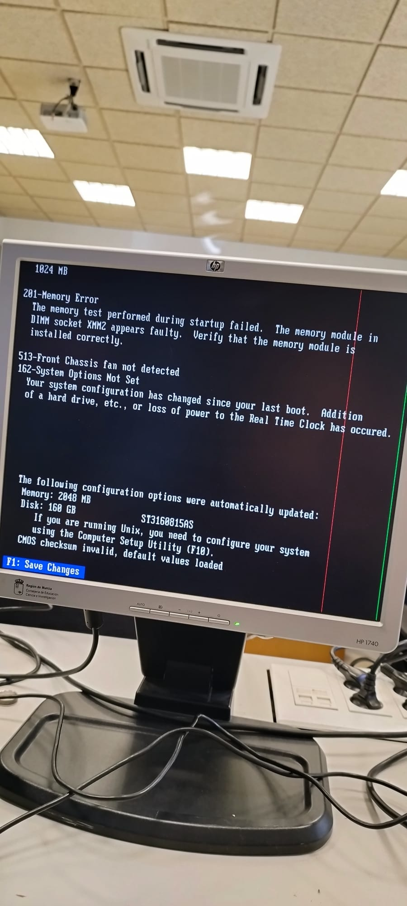
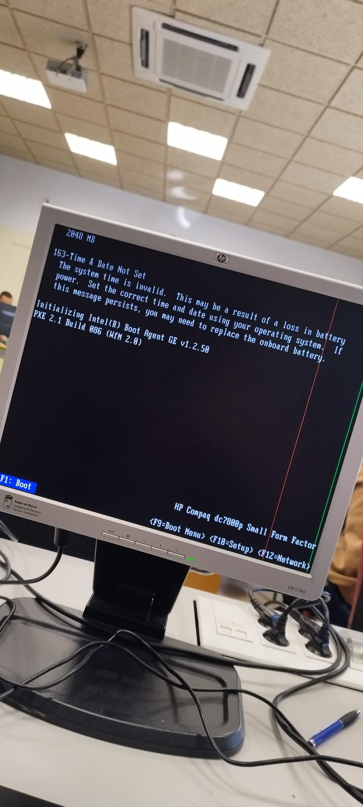
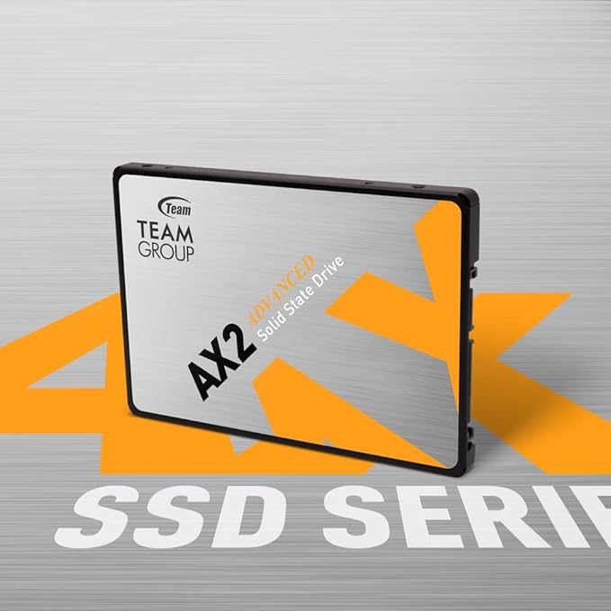
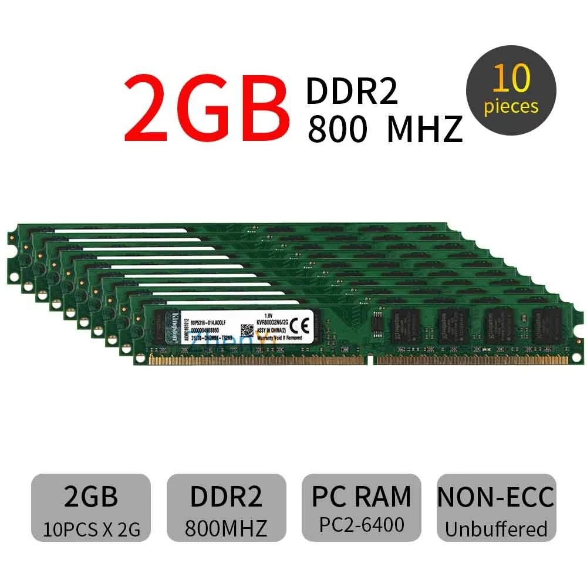
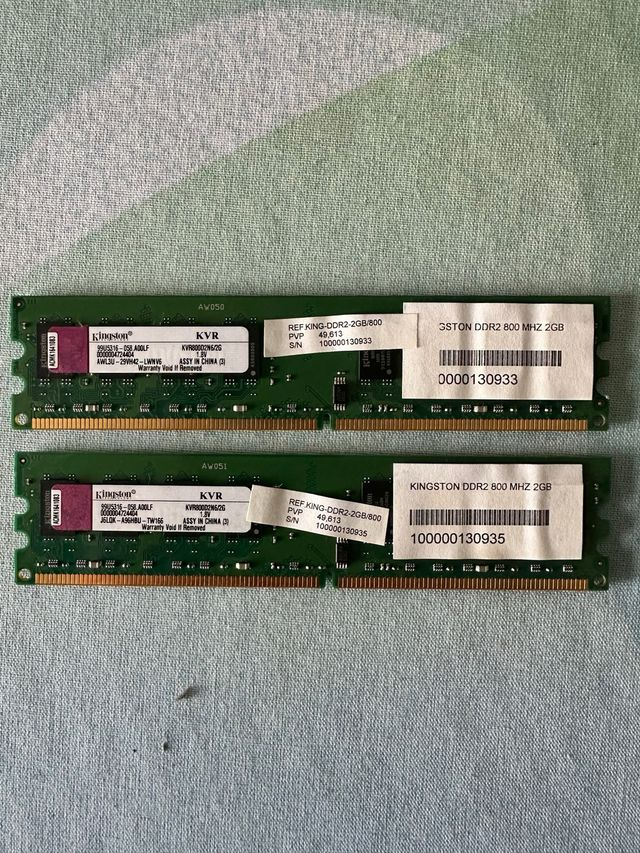
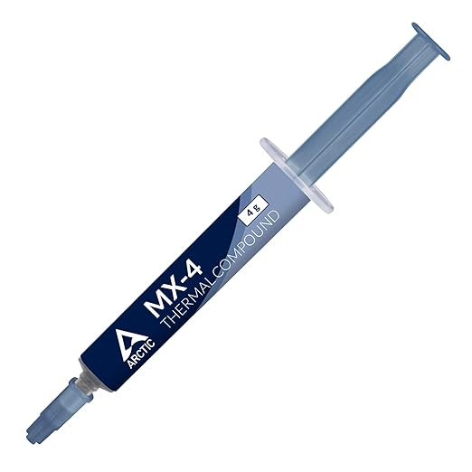
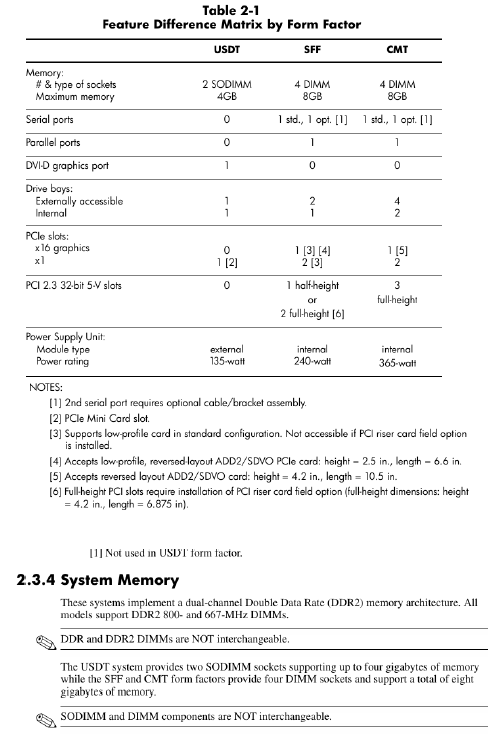
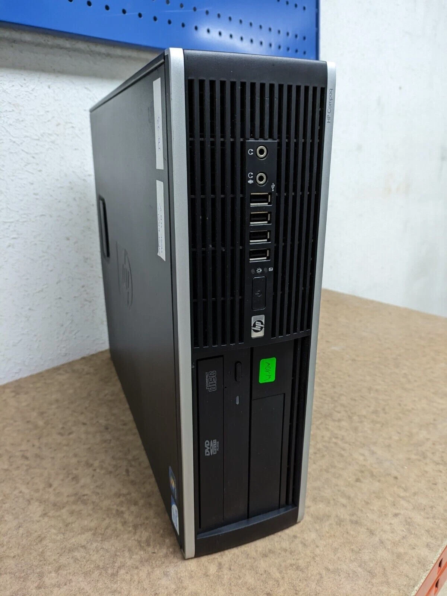
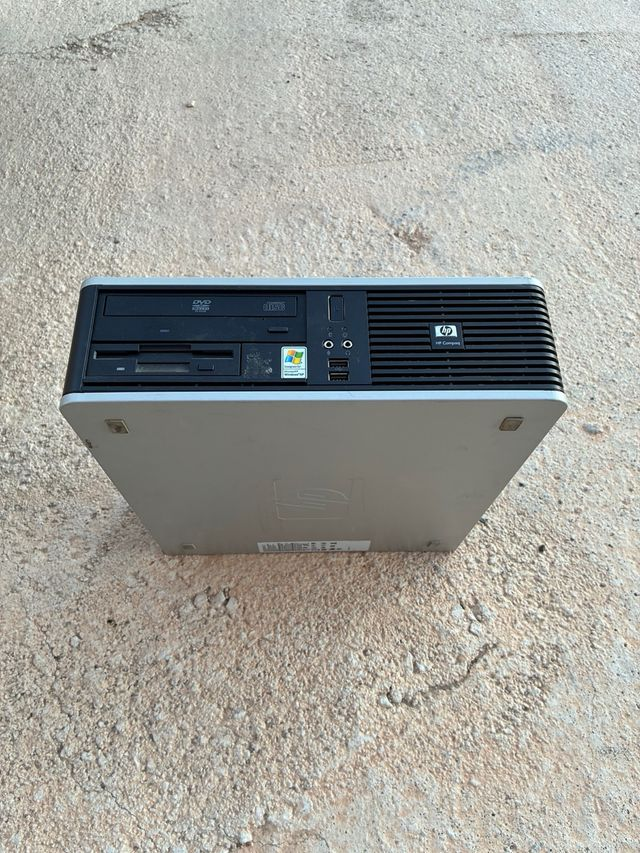
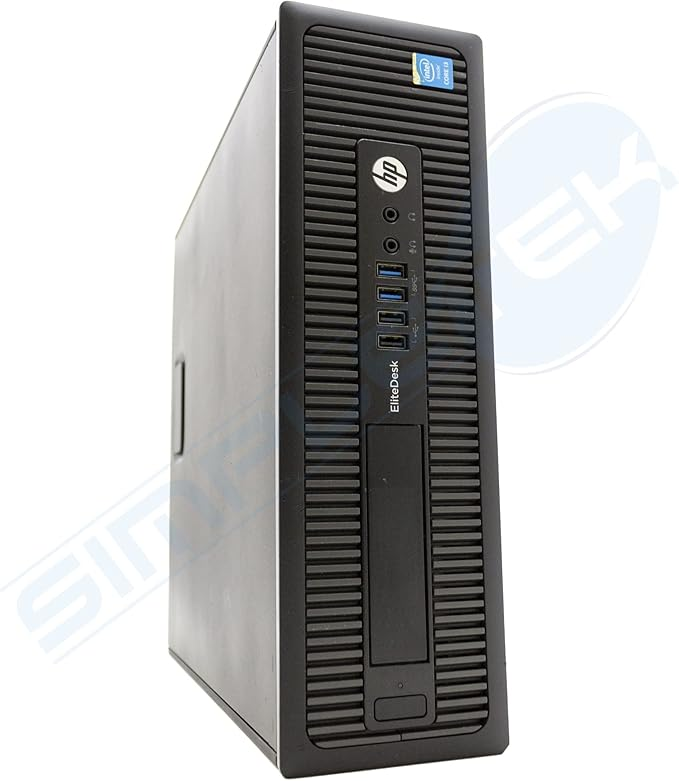

# 90 — ENTREGA ÚNICA (PDF)

Pega aquí todas las secciones (02, 10, 30, 65, 75) y exporta a **PDF único** con nombre:
# 02 — Contexto y requisitos

## Qué tienes que hacer
Redacta un **resumen breve** (6–10 líneas) con el **objetivo**, **restricciones** y **criterios de éxito**.

## Guía (cómo se hace y qué poner)
- **Objetivo:** PCs **usables** (web, correo, videollamada, ofimática online) para personas mayores **vía hardware mínimo**.
- **Restricciones:** compra **20 €**; escenario **S0/S1/S2**; **no se instala software** en este reto.
- **Criterios de éxito:** mejora perceptible con gasto bajo; compatibilidad garantizada; coste total competitivo.

Queremos conseguir que ordenadores antiguos sean funcionales para personas mayores, centrándonos en tareas como usar el navegador, el correo o hacer videollamadas, afectando lo mínimo en el hardware. Tenemos un presupuesto tope de 20€ para la compra de componentes y no está permitido instalar software en esta fase, ciñéndonos a los escenarios S0, S1 y S2.
Para darnos por aludido, debe haber una mejora de rendimiento que sea perceptible a simple vista con gastos al mínimo. Debemos asegurar la compatibilidad de las piezas y lograr un coste total que sea competitivo para revivir estos equipos.

# 10 — Diagnóstico inicial del lote

- Modelo de CPU / RAM / almacenamiento por **5 unidades muestreadas**.(NOTA-PREGUNTA POR LOS DEMAS GRUPOS para obtener estos datos - podeis verlo en sus repositorios.)
- Estado térmico (temperaturas reposo/carga breve).
- Problemas detectados (discos con sectores reasignados, ruido, etc.).

| ID Equipo            | CPU / Socket                    | RAM Instalada / Máx | Almacenamiento       | Ranuras/Bahías Libres      | Observaciones (Estado físico y térmico)                    |
| :--------------------- | :-------------------------------- | :--------------------- | :--------------------- | :---------------------------- | :------------------------------------------------------------- |
| **Equipo 01**        | Intel Core 2 Duo E6750 / LGA775 | 4 GB DDR2 / 8 GB     | HDD 160 GB (Samsung) | 0 slots RAM / 1 bahía 3.5" | Polvo residual y cables que podrían estar mejor gestionados |
| **Equipo 02**        | Intel Core 2 Duo E6750 / LGA775 | 4 GB DDR2 / 8 GB     | HDD 160 GB (Samsung) | 0 slots RAM / 1 bahía 3.5" | Polvo residual y mala gestión de los cables internos        |
| **Equipo 03 (Mío)** | Intel Core 2 Duo E6750 / LGA775 | 1 GB DDR2 / 8 GB     | HDD 160 GB (Seagate) | 3 slots RAM / 1 bahía 3.5" | Fallo en pila CMOS y chasis deformado o atascado             |
| **Equipo 04**        | Intel Core 2 Duo E6750 / LGA775 | 1 GB DDR2 / 8 GB     | HDD 160 GB (Seagate) | 3 slots RAM / 1 bahía 3.5" | Pasta térmica muy degradada y suciedad interna              |
| **Equipo 05**        | Intel Core 2 Duo E6750 / LGA775 | 1 GB DDR2 / 8 GB     | HDD 160 GB (Seagate) | 2 slots RAM / 1 bahía 3.5" | Mucho polvo acumulado y falta antena wifi                    |

**Capturas:** `../assets/img/10-diagnostico/`

# 30 — Búsqueda y selección de mejoras de **hardware**

> **Objetivo:** Encontrar las **mejoras mínimas** que conviertan cada PC en **usable** para el centro de mayores, **respetando** S0/S1/S2.

## 1) Piezas candidatas (con enlaces y capturas)

Busca en **tiendas online españolas** (PcComponentes, Amazon ES, Coolmod, Wallapop/segunda mano con precaución) y documenta **al menos 2 opciones por categoría** (cuando aplique):

- **Almacenamiento:** SSD 2.5" (120–240 GB) o adaptadores 2.5"→3.5".
- **Memoria RAM:** módulos compatibles (capacidad y MHz soportados por tu placa).
- **Mantenimiento:** pasta térmica económica, filtros de polvo, tornillería o caddy(**adaptador/bandeja (caddy) para montar una unidad de almacenamiento** en un hueco del PC).
- **Otros (si procede):** adaptador Wi-Fi USB de bajo coste, altavoz barato si no hay sonido, etc.

**Tabla por categoría (ejemplo SSD):**

| Categoria | Marca/Modelo | Capacidad | Precio (€) | Tienda | URL | Captura |
| :--- | :--- | :--- | :--- | :--- | :--- | :--- |
| SSD | Kingston A400 | 120 GB | 16.99 (07/02/2026) | Amazon ES | https://www.amazon.es/Kingston-A400-SSD-Disco-Sólido/dp/B01N6JQS8C |  |
| SSD | TeamGroup CX2 | 256 GB | 17.99 (07/02/2026) | Amazon ES | https://www.amazon.es/TEAMGROUP-CX2-256GB-Internal-Solid/dp/B08CKFDPJ3 |  |
| RAM | DDR2 PC2-6400 | 2 GB | 6.81 (07/02/2026) | eBay | https://www.ebay.es/itm/183656018363 |  |
| RAM | DDR2 800MHz | 2 GB | 6.00 (07/02/2026) | Wallapop | https://es.wallapop.com/item/2x-kingston-ddr2-2gb-800mhz-ram-1224981514 |  |
| Mantenimiento | Arctic MX-4 | 4 g | 7.19 (07/02/2026) | Amazon ES | https://www.amazon.es/Arctic-MX-4-Pasta-térmica-disipadores/dp/B07L9BDY3T |  |

> Guarda capturas en `../assets/img/30-hw/` con **URL completa** visible y **fecha/hora**.

## 2) Compatibilidad técnica (justifica con datos)

**_Compatibilidad de los componentes:_**
**Memoria RAM:**
Mi placa base (modelo HP 437793-001 con chipset Q35 Express) admite hasta 8 GB de RAM DDR2. Aunque los módulos actuales funcionan a 667 MHz, la placa soporta hasta 800 MHz, por lo que las piezas nuevas son totalmente compatibles. Además, al tener 4 ranuras y estar usando solo dos, tengo espacio físico de sobra para pinchar el módulo extra de 2 GB.

**Disco SSD:**
El equipo dispone de puertos SATA estándar, que es lo que necesito. El SSD que he elegido es SATA 3, y aunque la versión de los puertos de mi placa sea anterior, la tecnología es retrocompatible. Vamos, que funcionará perfectamente y se notará mucho la aceleración del sistema respecto al disco mecánico.

**Otros componentes:**
Al ser un chasis formato SFF (pequeño), instalaré el SSD de 2,5" en el hueco del disco antiguo usando un adaptador caddy para que quede bien sujeto y no baile. Por último, la pasta térmica seleccionada es apta para el socket LGA775 de mi procesador Intel Core 2 Duo E6750, lo cual es básico para mantener buenas temperaturas y evitar sobrecalentamientos.

> Incluye captura de **fuente oficial** (manual/hoja técnica de la placa o del fabricante de la pieza) donde se vea el dato clave (ej.: “hasta 8 GB DDR2-1600”).
> https://h10032.www1.hp.com/ctg/Manual/c01202501.pdf

## 3) Mini‑estimación de impacto (sentido común + referencias)
**De HDD a SSD:**
Este es sin duda el cambio que más se va a notar. Al quitar el viejo disco mecánico Seagate y poner el SSD Kingston, los tiempos de carga desaparecen. El sistema arranca rápido y los programas se abren al instante; esto es vital para que una persona mayor no se líe ni se frustre esperando a que el ordenador reaccione.

**De 1 GB a 3 GB de RAM:**
Ahora mismo con 1 GB el equipo se ahoga. Al añadir el módulo de 2 GB (para tener 3 GB en total), el ordenador podrá gestionar la multitarea real, como tener una videollamada y el navegador abiertos a la vez. Con esto evitamos que el sistema se quede "congelado" tirando de disco duro porque le falta memoria.

**Pasta térmica y limpieza:**
Aplicar la pasta MX-4 en el procesador y limpiar el polvo es básico para la salud del PC. Al mejorar la transferencia de calor, el ventilador no necesita girar tan rápido para enfriar el Core 2 Duo. El resultado es un equipo que no se calienta y, sobre todo, que hace mucho menos ruido ambiente.

> **No** se piden benchmarks. Usa criterio y referencias de fuentes fiables.

## 4) Escenario elegido y desglose de gasto (S0/S1/S2)

**Escenario S2:** Porque, con un presupuesto de 30 euros, puedo abarcar directamente los tres puntos críticos del equipo: el almacenamiento, la RAM y la temperatura.

| Escenario | Pieza | Precio (€) | Unidades | Subtotal (€) | Nota |
| :--- | :--- | :--- | :--- | :--- | :--- |
| **S2** | SSD Kingston 120 GB | 16.99 | 1 | 16.99 | Nuevo en Amazon |
| **S2** | RAM 2 GB DDR2 | 5 | 1 | 5 | Segunda mano Wallapop |
| **S2** | Pasta térmica Arctic | 5.60 | 1 | 5.60 | Bote para varios usos |
| | **Total HW** | | | **27.59** | |

El gasto total de **27,59 euros** entra perfectamente dentro del límite de los 30 euros marcados para el escenario S2.
Luego traslada el **Total HW** a `75-plan_presupuesto_hw_y_roi.md` para calcular costes y ROI.

# 65 — Análisis de mercado y PVP
### Comparables (3 mínimos)

| Plataforma | Enlace | Captura | Precio (€) | Especificación | Fecha/Hora |
| :--- | :--- | :--- | :--- | :--- | :--- |
| **eBay** | https://www.ebay.es/itm/397326796833 |  | 25.90 | hp compaq 8200 core 2 duo 4gb ram 160gb hdd | 07/02/2026 20:37 |
| **Wallapop** | https://es.wallapop.com/item/hp-compaq-dc7800-sff-pc-1206548261 |  | 38 | hp compaq core 2 duo gama basica | 07/02/2026 20:45 |
| **Amazon** | https://www.amazon.es/dp/B09X1TCHSL |  | 165 | mini pc o equipo reacondicionado | 07/02/2026 21:04 |

He buscado estos tres equipos en el mercado actual para ver qué precios tienen los ordenadores que son parecidos al mío en potencia y uso. Estas referencias me sirven para saber si mi proyecto es competitivo y si el centro de mayores ahorra dinero con mi trabajo de mejora.

### PVP objetivo

* **Media precios comparables:** 76.30€
* **Margen de competitividad:** 15%
* **PVP objetivo:** 65€

# 75 — Plan de presupuesto (HW) y ROI

> Tras decidir **S2** en `30-busqueda_mejoras_hw.md`, completar costes y ROI del equipo 3.

- **Tarifa interna:** 20€/h  
- **Horas por equipo**: 50'

| Escenario | Gasto HW (euros) | Horas | Tarifa (eur/h) | Coste total (euros) | PVP objetivo (euros) | ROI | ¿Competitivo? |
| :--- | :--- | :--- | :--- | :--- | :--- | :--- | :--- |
| **S0** | 0 | 50' | 20 | 30 | 65 | 116.66% | Si |
| **S1** | 15 | 50' | 20 | 45 | 65 | 44.44% | Si |
| **S2** | 25 | 50' | 20 | 55 | 65 | 18.18% | Si |

**Cuentas y resultados:**
Para calcular el coste real del escenario S2, he sumado los 20 euros de la compra inicial del PC, los 25 euros de los componentes nuevos y los 10 euros que corresponden a mi media hora de trabajo. Esto me deja un Coste total de 55,00 € ($20 + 25 + 10 = 55$).

Respecto a la rentabilidad (ROI), la obtengo restando este coste total al precio de venta objetivo y dividiendo por el coste. La cuenta es $(65.00 - 55.00) / 55.00 = 0.1818$, lo que significa que tenemos un margen de beneficio del 18,18%.

**Elección final:**
Al final he elegido el escenario S2. Es cierto que en las opciones S0 o S1 el porcentaje de beneficio es mayor, pero la mejora de calidad que consigue el usuario con el S2 es incomparable gracias al SSD y la ampliación de RAM.

El proyecto es totalmente viable porque, con un coste final de 55,00 euros, sigo estando por debajo del PVP de mercado de 65,00 euros que marcamos en el análisis. Esta decisión me permite entregar un equipo rápido y 100% funcional, cumpliendo el objetivo de dar una herramienta útil al centro de mayores por un precio muy bajo.
